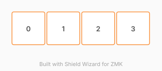

# ZMK Configuration for test_kb

*Generated by Shield Wizard for ZMK*



Download compiled firmware from the Actions tab. <https://zmk.dev/docs/user-setup#installing-the-firmware>

Edit your keymap <https://zmk.dev/docs/keymaps>.
User keymap is located at [`config/test_kb.keymap`](config/test_kb.keymap).

---

## 🔐 Setup 2.4G AES Encryption Key

To generate a random 128-bit AES Key for secure wireless communication and compile your firmware:

1. Go to the **Actions** tab in your GitHub repository.
2. In the left sidebar, select **Generate AES Key and Build**.
3. Click the **Run workflow** dropdown menu on the right.
4. Select your branch (e.g., `main`) and click **Run workflow**.

> **Note:** This action automatically scans all `.conf` files in the `config/` directory for `CONFIG_ZMK_2G4_AES_KEY`, updates them with a matching random 32-character hexadecimal key, commits the changes to your repository, and triggers the ZMK firmware build process immediately. Subsequent standard builds will reuse this generated key.

---

<details>
<summary>
Shield Wizard Debug Information
</summary>

In case of broken configuration, here is the Shield Wizard internal data used to generate this configuration:

Commit: c6078aab2a34eefa8ab8d00f2fc656779fdcfa46

```json
{"name":"test_kb","shield":"test_kb","dongle":false,"modules":[],"layout":[{"id":"01KZT24W7TKB5CMMYNASNXYWR2","part":0,"row":0,"col":0,"w":1,"h":1,"x":0,"y":0,"r":0,"rx":0,"ry":0},{"id":"01KZT24WDHRCV0YTDXBY37HYGC","part":0,"row":0,"col":1,"w":1,"h":1,"x":1,"y":0,"r":0,"rx":0,"ry":0},{"id":"01KZT24WKS1KM661W83QJ95FYV","part":0,"row":0,"col":2,"w":1,"h":1,"x":2,"y":0,"r":0,"rx":0,"ry":0},{"id":"01KZT24X5HBHQ7SG2P06PQ7VZV","part":0,"row":0,"col":3,"w":1,"h":1,"x":3,"y":0,"r":0,"rx":0,"ry":0}],"parts":[{"name":"unibody","controller":"nice_nano_v2","pins":{"d8":{"usage":"kscan","kscan":"01KZT2581DMMXQDBGQK0GM0HYN","role":"input"},"d9":{"usage":"kscan","kscan":"01KZT2581DMMXQDBGQK0GM0HYN","role":"input"},"d16":{"usage":"kscan","kscan":"01KZT2581DMMXQDBGQK0GM0HYN","role":"input"},"d10":{"usage":"kscan","kscan":"01KZT2581DMMXQDBGQK0GM0HYN","role":"input"}},"kscans":[{"kind":"direct","id":"01KZT2581DMMXQDBGQK0GM0HYN","mode":"gnd"}],"keys":{"01KZT24W7TKB5CMMYNASNXYWR2":{"input":"d8"},"01KZT24WDHRCV0YTDXBY37HYGC":{"input":"d9"},"01KZT24WKS1KM661W83QJ95FYV":{"input":"d16"},"01KZT24X5HBHQ7SG2P06PQ7VZV":{"input":"d10"}},"encoders":[],"buses":{}}]}